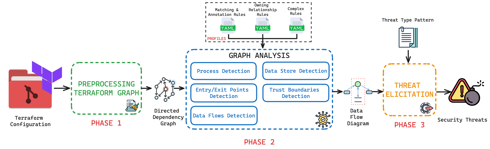

# TerrARA: Automated Security Threat Modeling for Infrastructure as Code
TerrARA, a framework that (1) automates the construction of Data Flow Diagrams (DFDs) from Terraform IaC configuration files, (2) enriches these models with relevant annotations regarding the used cloud infrastructure, and (3) implements cloud computing threat patterns and leverages the SPARTA threat modeling engine to automatically identify these threats in the extracted models.
## Architecture:


## Steps
0. Run `memgraph` with: `docker compose -f ./memgraph-compose.yaml up`
1. Create new python virtualenv (venv, pipenv, ...)
2. Install dependencies
- `pip install -r requirements.txt`
3. Analyze with this tool
- `./main.py <terraform_project_path> -o <folder_path_to_store_dfd_dot> `
- `-o ..` part is optional, default to current directory output folder
- `--reinit=False` to disable project reinit (for second run)
- `-a`: specify path to annotation (default to `./input/aws_annotation.yaml`)
- `-s`: specify path to semgrep rule for public boundaries identification (default to `./input/semgrep_rule.yaml`)
- `--rule_path`: specify path to rule of relation (default to `./input/aws_rule.yaml`)
- `--graph_mode=True` to export graph instead of sparta
- `-f`: specify path to semgrep rule for depends_on (default to `./input/depend_on_rule.yaml`) 
- `--rm_depend_on=False` to disable "depends_on" removal
4. You can find some examples of commands in the sample folder. It works well in the linux-based system. You also need docker for running.

---
## Annotation structure
- Contain 4 main keys: `processes`, `boundaries`, `data_stores` and `external_entities`. The configuration must contain all of these keys.
```yaml
processes:
    # ...
boundaries:
    # ...
data_stores:
    # ...
external_entities:
    # ...
``` 
- `external_entities` contains an array of external entities that should represent in the graph. Each element has 2 keys: `name` and `annotation`, to give name and annotation to External Entity in final DFD
- Each key contains an array of info about group and its members. Info structure is the same for process, boundary and data store, there are 3 keys to fulfill: `group_name`, `annotation` and `members`. This is where you annotate the terraform resource in to group and showed name on DFD 
```yaml
    - group_name: VirtualMachine # Name of the group
      annotation: VirtualMachine # Annotation for Advanced DFD. It is one of the following:
                                 # CloudApplication: Represent applications/services that have ability of computational in infrastructure, except the virtual machine
                                 # ExternalService: Service that is interracting outside of system
                                 # Container: Service that is related to Container (docker, ECS, ...)
      members:
        # ... 
```
- Each group will have an array of members, mapping from terraform "resource type" to its general name. Structure of member will have 4 keys: `name`, `tf_name`, `can_public` and `compress`
```yaml
        - name: AwsAmplify          # General name of resource type
          tf_name: aws_amplify_\w*  # Resource type in terraform, based on https://registry.terraform.io. This can be string or regex
          compress: true            # Optional, default is false. Compressing matched resource (use with regex tf_name) to a single node 
                                    # in DFD. There will be a tradeoff between Component detection & Data flow detection in this option
          can_public: true          # Optional, default is false. Marked this resource type can be public (accessible by user)
```

## Ruleset structure
- Contain 2 main keys: `relations` and `publics`. The configuration must contain all of these keys.
```yaml
relations:
    # ...
publics:
    # ...
```
### Relations
- `relations` will contains 2 key of rules: owning rules (`own`) & special dataflow rule (`direct_flow`, currently not implemented)
```yaml
    own:
        # ...
    direct_flow:
        # ...
```  
- `own` key contain an array of owning rules, showing which component can be in boundary, or which boundary can be in other boundary. Each rule has 4 keys: `id`, `first_node`, `second_node` and `method`:
```yaml
        - id: subnet2vpc                # Unique name to separate between rules
          first_node: VirtualNetwork    # Group name of first "resource" node to detect
          second_node: Subnet           # Group name of second "resource" node to detect
          method: Backward              # Type of connection between 2 resource. It is one of the following:
                                        # Backward: Second node target First node in dependency graph
                                        # Forward: First node target Second node in dependency graph
                                        # IntersectForward: 2 nodes target a common node (unimplemented)
                                        # IntersectBackward: A common node targets 2 nodes (unimplemented)
```
### Public
- `publics` will contains an array of info about component that can be detected the publicity through semgrep. Each info structure has 2 keys: `id` and `variable`
```yaml
  - id: publicsubnet    # Unique name to separate between rules
    variable: $SN_NAME  # Metavariable name that is declared in semgrep rule (must be resource name)
```
